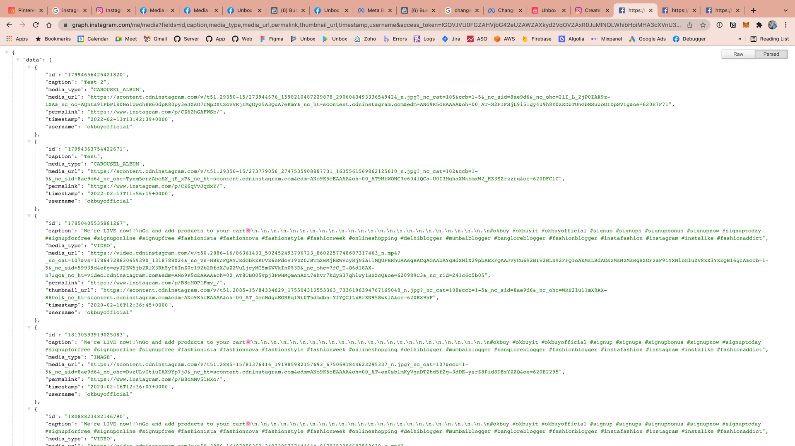

# unbox-server

Force Build -> 4

[](https://github.com/lcbasu/unbox-server/actions/workflows/master-build-deploy.yml)


Choose Language -> Login -> Select User Category (Default to Employer) -> Create/Select Store -> Select App -> Employer Screens for Selected App.

DK Shop Screens

Shopkeeper:
Create Shop -> Create Username -> Add Products -> Add Categories
-> Start Selling by sharing link
-> Add Bank account details if you need to accept online payment
-> Ship through ShipRocket
-> Add custom domain
-> Download APK and share your store app
-> Send alerts to shopkeepers about the customer who should be contacted for repeat orders
-> For 5K per month, we will do offline advertisement. We will hire a superman/women whose only work is to visit nearby houses and educate them about the advertiser.

Customers:
Visit Link -> Add to cart -> Login -> Add Address -> Select Payment Mode -> Place Order


## Cassandra Counters
https://docs.datastax.com/en/cql-oss/3.3/cql/cql_using/useCountersConcept.html

Because counters are implemented differently from other columns, counter columns can only be created in dedicated tables. A counter column must have the datatype counter data type. This data type cannot be assigned to a column that serves as the primary key or partition key. To implement a counter column, create a table that only includes:

Video Upload and Delivery

1. User opens app
2. User uploads the image/video
3. User submits the post (Only allow this if the user has uploaded the video to S3)
4. We save the only 2 feeds -> post and posts_by_user
5. Once the media processing is done, we reprocess the above 2 feed along with all the dependent feeds.


## Reading Instagram Media

#### Get list of all media for a user

```
https://graph.instagram.com/me/media?fields=id,caption,media_type,media_url,permalink,thumbnail_url,timestamp,username&access_token=IGQVJVU0FGZAHVjbG42eUZAWZAXkyd2VqOVZAxR0JuMlNQLWhibHpiMHA3cXVnU3ptSlRPOTNCWUctTEJUUm1wSjd0ZAGp3LTRDNUY1eV9BSldjNjNLa2xiZAnJ0T2piRzdod0JRTWZAkNGxqb2d3SEVOY1ZAnZAwZDZD
```



#### Media Types
1. Image (IMAGE) -> Directly available without any extra processing
2. Video (VIDEO) -> Directly available without any extra processing
3. Carousel (CAROUSEL_ALBUM) -> Needs extra processing


#### Get Media Details for CAROUSEL_ALBUM

1. Get the id of the Post
2. Get all the media children IDs using this API.
    1. https://graph.instagram.com/17994656425421820/children?access_token=IGQVJVU0FGZAHVjbG42eUZAWZAXkyd2VqOVZAxR0JuMlNQLWhibHpiMHA3cXVnU3ptSlRPOTNCWUctTEJUUm1wSjd0ZAGp3LTRDNUY1eV9BSldjNjNLa2xiZAnJ0T2piRzdod0JRTWZAkNGxqb2d3SEVOY1ZAnZAwZDZD
3. Run a loop through the media children IDs and get the media details for each child.
    1. https://graph.instagram.com/18046861537311623?fields=id,media_type,media_url,username,timestamp&access_token=IGQVJVU0FGZAHVjbG42eUZAWZAXkyd2VqOVZAxR0JuMlNQLWhibHpiMHA3cXVnU3ptSlRPOTNCWUctTEJUUm1wSjd0ZAGp3LTRDNUY1eV9BSldjNjNLa2xiZAnJ0T2piRzdod0JRTWZAkNGxqb2d3SEVOY1ZAnZAwZDZD

#### Fields for Media

`caption`
The Media's caption text. Not returnable for Media in albums.

`id`
The Media's ID.

`media_type`
The Media's type. Can be IMAGE, VIDEO, or CAROUSEL_ALBUM.

`media_url`
The Media's URL.

`permalink`
The Media's permanent URL. Will be omitted if the Media contains copyrighted material, or has been flagged for a copyright violation.

`thumbnail_url`
The Media's thumbnail image URL. Only available on VIDEO Media.

`timestamp`
The Media's publish date in ISO 8601 format.

`username`
The Media owner's username.

Setup Prometheus on EC2:

Video: https://www.youtube.com/watch?v=hfWl8k8m4n8

```

Last login: Wed Mar 16 00:39:36 on console
➜  ~ cd Developer 
➜  Developer chmod 400 dukaankhata-eb-prod.pem
chmod: dukaankhata-eb-prod.pem: No such file or directory
➜  Developer chmod 400 dukaankhata-eb-prod.pem
chmod: dukaankhata-eb-prod.pem: No such file or directory
➜  Developer cd ..
➜  ~ cd Developer 
➜  Developer cd ..
➜  ~ cd Desktop 
➜  Desktop chmod 400 dukaankhata-eb-prod.pem
➜  Desktop ssh -i "dukaankhata-eb-prod.pem" ec2-user@ec2-3-111-32-248.ap-south-1.compute.amazonaws.com
The authenticity of host 'ec2-3-111-32-248.ap-south-1.compute.amazonaws.com (3.111.32.248)' can't be established.
ECDSA key fingerprint is SHA256:+WRs4uEHe26nDRtkpLRruQkVkg0ri2L1y/hy7Iy8SB4.
Are you sure you want to continue connecting (yes/no/[fingerprint])? yes
Warning: Permanently added 'ec2-3-111-32-248.ap-south-1.compute.amazonaws.com,3.111.32.248' (ECDSA) to the list of known hosts.

       __|  __|_  )
       _|  (     /   Amazon Linux 2 AMI
      ___|\___|___|

https://aws.amazon.com/amazon-linux-2/
[ec2-user@ip-172-31-5-194 ~]$ sudo yum update -y
Failed to set locale, defaulting to C
Loaded plugins: extras_suggestions, langpacks, priorities, update-motd
No packages marked for update
[ec2-user@ip-172-31-5-194 ~]$ sudo useradd --no-create-home --shell /bin/false prometheus
[ec2-user@ip-172-31-5-194 ~]$ sudo mkdir /etc/prometheus
[ec2-user@ip-172-31-5-194 ~]$ sudo mkdir /var/lib/prometheus
[ec2-user@ip-172-31-5-194 ~]$ sudo chown prometheus:prometheus /etc/prometheus
[ec2-user@ip-172-31-5-194 ~]$ sudo chown prometheus:prometheus /var/lib/prometheus
[ec2-user@ip-172-31-5-194 ~]$ curl -LO https://github.com/prometheus/prometheus/releases/download/v2.34.0/prometheus-2.34.0.linux-amd64.tar.gz
  % Total    % Received % Xferd  Average Speed   Time    Time     Time  Current
                                 Dload  Upload   Total   Spent    Left  Speed
100   671  100   671    0     0   2557      0 --:--:-- --:--:-- --:--:--  2551
100 72.7M  100 72.7M    0     0  7607k      0  0:00:09  0:00:09 --:--:-- 4365k
[ec2-user@ip-172-31-5-194 ~]$ tar -xvf prometheus-2.34.0.linux-amd64.tar.gz 
prometheus-2.34.0.linux-amd64/
prometheus-2.34.0.linux-amd64/consoles/
prometheus-2.34.0.linux-amd64/consoles/index.html.example
prometheus-2.34.0.linux-amd64/consoles/node-cpu.html
prometheus-2.34.0.linux-amd64/consoles/node-disk.html
prometheus-2.34.0.linux-amd64/consoles/node-overview.html
prometheus-2.34.0.linux-amd64/consoles/node.html
prometheus-2.34.0.linux-amd64/consoles/prometheus-overview.html
prometheus-2.34.0.linux-amd64/consoles/prometheus.html
prometheus-2.34.0.linux-amd64/console_libraries/
prometheus-2.34.0.linux-amd64/console_libraries/menu.lib
prometheus-2.34.0.linux-amd64/console_libraries/prom.lib
prometheus-2.34.0.linux-amd64/prometheus.yml
prometheus-2.34.0.linux-amd64/LICENSE
prometheus-2.34.0.linux-amd64/NOTICE
prometheus-2.34.0.linux-amd64/prometheus
prometheus-2.34.0.linux-amd64/promtool
[ec2-user@ip-172-31-5-194 ~]$ mv prometheus-2.34.0.linux-amd64 prometheus-2.34.0.linux-amd64^C
[ec2-user@ip-172-31-5-194 ~]$ mv prometheus-2.34.0.linux-amd64 prometheus-files
[ec2-user@ip-172-31-5-194 ~]$ ls
prometheus-2.34.0.linux-amd64.tar.gz  prometheus-files
[ec2-user@ip-172-31-5-194 ~]$ sudo cp prometheus-files/prometheus /usr/local/bin/
[ec2-user@ip-172-31-5-194 ~]$ sudo cp prometheus-files/promtool /usr/local/bin/
[ec2-user@ip-172-31-5-194 ~]$ sudo chown prometheus:prometheus /usr/local/bin/prometheus
[ec2-user@ip-172-31-5-194 ~]$ sudo chown prometheus:prometheus /usr/local/bin/promtool
[ec2-user@ip-172-31-5-194 ~]$ sudo cp -r prometheus-files/consoles /etc/prometheus
[ec2-user@ip-172-31-5-194 ~]$ sudo cp -r prometheus-files/console_libraries /etc/prometheus
[ec2-user@ip-172-31-5-194 ~]$ sudo chown -R prometheus:prometheus /etc/prometheus/consoles
[ec2-user@ip-172-31-5-194 ~]$ sudo chown -R prometheus:prometheus /etc/prometheus/console_libraries
[ec2-user@ip-172-31-5-194 ~]$ ls
prometheus-2.34.0.linux-amd64.tar.gz  prometheus-files
[ec2-user@ip-172-31-5-194 ~]$ ls -la
total 74524
drwx------ 4 ec2-user ec2-user      142 Mar 16 03:46 .
drwxr-xr-x 3 root     root           22 Mar 16 03:39 ..
-rw-r--r-- 1 ec2-user ec2-user       18 Jul 15  2020 .bash_logout
-rw-r--r-- 1 ec2-user ec2-user      193 Jul 15  2020 .bash_profile
-rw-r--r-- 1 ec2-user ec2-user      231 Jul 15  2020 .bashrc
drwx------ 2 ec2-user ec2-user       29 Mar 16 03:39 .ssh
-rw-rw-r-- 1 ec2-user ec2-user 76299772 Mar 16 03:45 prometheus-2.34.0.linux-amd64.tar.gz
drwxr-xr-x 4 ec2-user ec2-user      132 Mar 15 15:33 prometheus-files
[ec2-user@ip-172-31-5-194 ~]$ sudo vi /etc/prometheus/prometheus.yml
[ec2-user@ip-172-31-5-194 ~]$ sudo chown prometheus:prometheus /etc/prometheus/prometheus.yml
[ec2-user@ip-172-31-5-194 ~]$ sudo vi /etc/systemd/system/prometheus.service
[ec2-user@ip-172-31-5-194 ~]$ sudo vi /etc/systemd/system/prometheus.service
[ec2-user@ip-172-31-5-194 ~]$ sudo vi /etc/systemd/system/prometheus.service
[ec2-user@ip-172-31-5-194 ~]$ sudo vi /etc/systemd/system/prometheus.service
[ec2-user@ip-172-31-5-194 ~]$ sudo systemctl daemon-reload
[ec2-user@ip-172-31-5-194 ~]$ sudo systemctl start prometheus
[ec2-user@ip-172-31-5-194 ~]$ sudo systemctl status prometheus
● prometheus.service - Prometheus
   Loaded: loaded (/etc/systemd/system/prometheus.service; disabled; vendor preset: disabled)
   Active: active (running) since Wed 2022-03-16 03:55:14 UTC; 27s ago
 Main PID: 3492 (prometheus)
   CGroup: /system.slice/prometheus.service
           └─3492 /usr/local/bin/prometheus --config.file /etc/prometheus/prometheus.yml --storage.tsdb.path /var/lib/prometheus/ --web.console.templates=/etc/prometheus/consoles --web.c...

Mar 16 03:55:14 ip-172-31-5-194.ap-south-1.compute.internal prometheus[3492]: ts=2022-03-16T03:55:14.528Z caller=head.go:536 level=info component=tsdb msg="On-disk memory mappab…tion=4.16µs
Mar 16 03:55:14 ip-172-31-5-194.ap-south-1.compute.internal prometheus[3492]: ts=2022-03-16T03:55:14.528Z caller=head.go:542 level=info component=tsdb msg="Replaying WAL, this m... a while"
Mar 16 03:55:14 ip-172-31-5-194.ap-south-1.compute.internal prometheus[3492]: ts=2022-03-16T03:55:14.531Z caller=tls_config.go:195 level=info component=web msg="TLS is disabled....tp2=false
Mar 16 03:55:14 ip-172-31-5-194.ap-south-1.compute.internal prometheus[3492]: ts=2022-03-16T03:55:14.531Z caller=head.go:613 level=info component=tsdb msg="WAL segment loaded" s...Segment=0
Mar 16 03:55:14 ip-172-31-5-194.ap-south-1.compute.internal prometheus[3492]: ts=2022-03-16T03:55:14.531Z caller=head.go:619 level=info component=tsdb msg="WAL replay completed"…=3.004357ms
Mar 16 03:55:14 ip-172-31-5-194.ap-south-1.compute.internal prometheus[3492]: ts=2022-03-16T03:55:14.533Z caller=main.go:958 level=info fs_type=XFS_SUPER_MAGIC
Mar 16 03:55:14 ip-172-31-5-194.ap-south-1.compute.internal prometheus[3492]: ts=2022-03-16T03:55:14.533Z caller=main.go:961 level=info msg="TSDB started"
Mar 16 03:55:14 ip-172-31-5-194.ap-south-1.compute.internal prometheus[3492]: ts=2022-03-16T03:55:14.533Z caller=main.go:1142 level=info msg="Loading configuration file" filenam...theus.yml
Mar 16 03:55:14 ip-172-31-5-194.ap-south-1.compute.internal prometheus[3492]: ts=2022-03-16T03:55:14.539Z caller=main.go:1179 level=info msg="Completed loading of configuration file" fil…µs
Mar 16 03:55:14 ip-172-31-5-194.ap-south-1.compute.internal prometheus[3492]: ts=2022-03-16T03:55:14.539Z caller=main.go:910 level=info msg="Server is ready to receive web requests."
Hint: Some lines were ellipsized, use -l to show in full.
[ec2-user@ip-172-31-5-194 ~]$ 


```
